# GISP — FULL DEMO MASTER PLAN

**Document Version:** 1.1  
**Status:** Optional Demo Enhancement — Not an MVP Gate  
**Prepared:** 1 สิงหาคม 2569 (2026-08-01)  
**Business Authority:** `MVP BUSINESS MASTER PLAN.md`  
**Decision Authority:** `DECISION LOG.md`  
**Existing Demo Specification:** `DEMO STORY AND MOCK DATA.md`  
**Target URL:** `https://gisp-mvp-demo.insforge.site`  

---

## 0. วิธีใช้เอกสารและลำดับอำนาจ

เอกสารนี้เป็นแผนเตรียมปรับ Demo เดิมให้เป็น Full Demo แบบเส้นทางเดียว ไม่ใช่เอกสารที่แก้ไข
Business Rule ของ GISP หากข้อความในเอกสารนี้ขัดกับเอกสารลำดับสูงกว่า ให้หยุดเฉพาะส่วนที่ขัดแย้ง
และใช้ลำดับต่อไปนี้:

1. `MVP BUSINESS MASTER PLAN.md` โดยเฉพาะหัวข้อ Approved Decisions
2. `DECISION LOG.md`
3. `MVP IMPLEMENTATION PLAN.md`
4. `FULL DEMO MASTER PLAN.md`
5. `DEMO STORY AND MOCK DATA.md`
6. เอกสาร Development, Database และ UX/UI ฉบับรายละเอียด

ตาม DEC-030 Demo Version 1.3 ที่ Deploy อยู่เป็น Baseline สำหรับ Human UAT และ Demo Gate
ปัจจุบัน เอกสาร Full Demo นี้ไม่แทนที่ Gate ดังกล่าวและไม่สร้างเงื่อนไขก่อนเริ่ม MVP เพิ่มเติม

คำว่า **Full Demo** ในเอกสารนี้หมายถึงการรวม Overview Demo, Functional Prototype และ
MVP Readiness/UAT ที่ได้รับอนุมัติแล้วให้เป็นประสบการณ์เดียว ไม่ได้หมายถึงการเพิ่ม Feature
Post-MVP หรือเริ่มพัฒนา Application จริง

---

## 1. เป้าหมายของ Full Demo

ผู้ทดลองต้องเปิดลิงก์เดียวและเข้าใจว่าเป็น Application เดียว โดยสามารถเดินเรื่องตั้งแต่สมัครสมาชิก
จนถึงส่งมอบ เคลม และ UAT ได้ต่อเนื่องโดยไม่ต้องเลือก Demo หลายชุด

ผลลัพธ์ที่ต้องได้:

- มี Landing Page หรือ `Demo Home` เป็นจุดเริ่มต้นเดียว
- มี Progress ชุดเดียวตลอดทั้ง Demo
- ใช้ Riverstone Mock Data ชุดเดียว
- ทุกขั้นมีคำอธิบาย, การทดลองทำ, กรณีผิดปกติ และผล UAT อยู่ในบริบทเดียวกัน
- ข้อมูลจากขั้นก่อนเป็นข้อมูลต้นทางของขั้นถัดไป
- Role Handoff เปิดงานและสลับบทบาทให้ผู้ทดลองอย่างชัดเจน
- Business Guard ป้องกันการข้ามขั้นตาม Business Master Plan
- ผู้ทดลองเปิดเมนูไปดูขั้นอื่นได้ แต่ Action ที่ยังไม่ผ่านเงื่อนไขต้องถูก Block พร้อมข้อความเข้าใจง่าย
- ผลการตรวจ Full Demo ใช้ปรับคุณภาพการนำเสนอเท่านั้น; สถานะ `APPROVED FOR MVP BUILD`
  มาจาก Human UAT ของ Demo Version 1.3 ตาม DEC-030

Full Demo ยังคงเป็น Browser-local Prototype และห้ามเชื่อม Transaction API หรือข้อมูลจริง

---

## 2. ปัญหาของ Demo ปัจจุบันที่ต้องแก้

Demo ปัจจุบันมี URL หลักเดียว แต่ประสบการณ์ถูกแบ่งเป็นหลายเส้นทาง:

- Landing Page ให้เลือก Overview หรือ Functional Prototype
- Overview มี Progress 10 Scene ของตนเอง
- Functional Prototype/MVP Readiness มี Progress 8 Mission อีกชุด
- Overview State และ Prototype State ใช้ Local Storage คนละ Key
- Overview เริ่มจาก Project แต่ Functional Prototype เริ่มจาก Foundation
- UAT อยู่ใน Prototype แต่ไม่มีความเชื่อมโยงโดยตรงกับ Scene ที่ผู้ใช้เพิ่งทดลอง
- Reset และสถานะสำเร็จของแต่ละชุดไม่สัมพันธ์กัน

สิ่งที่ต้องเปลี่ยนคือโครงสร้างการนำเสนอและ State ไม่ใช่การสร้าง Demo Project หรือ URL ใหม่

---

## 3. แนวคิดประสบการณ์ใหม่

### 3.1 หนึ่ง Demo หนึ่งเรื่อง หนึ่ง State

```mermaid
flowchart LR
    HOME["Demo Home"] --> FND["1. บริษัทและสิทธิ์"]
    FND --> MASTER["2. Product และ Supplier"]
    MASTER --> PROJECT["3. Project และ Catalog"]
    PROJECT --> RFQ["4. Custom RFQ"]
    RFQ --> QT["5. Custom Quotation"]
    QT --> ORDER["6. Order และ Payment"]
    ORDER --> QC["7. Production และ QC"]
    QC --> SHIP["8. Shipment และ Delivery"]
    SHIP --> CLAIM["9. Claim"]
    CLAIM --> CLOSE["10. Dashboard เอกสาร และ UAT"]
```

### 3.2 สี่ชั้นในทุก Workflow

แต่ละ Workflow ใช้โครงสร้างเดียวกัน:

1. **ดูภาพรวม** — อธิบายวัตถุประสงค์ ผู้ทำงาน เอกสาร และกฎสำคัญจาก Overview เดิม
2. **ทดลองทำ** — กรอก แก้ไข อนุมัติ และส่งต่องานจาก Functional Prototype
3. **ทดสอบข้อผิดปกติ** — ทดลอง Guard, Reject, Revision, Rework หรือ Recovery ที่เกี่ยวข้อง
4. **บันทึกผล UAT** — เลือก `ผ่าน` หรือ `ต้องแก้` พร้อมหมายเหตุใน Scenario ที่เกี่ยวข้อง

Overview จึงไม่เป็นโหมดแยกอีกต่อไป แต่เป็น Context Panel ของแต่ละ Workflow

### 3.3 Progress ชุดเดียว

Progress หลักแสดง `ขั้นปัจจุบัน / 10` และมีสถานะต่อขั้น:

- `NOT_STARTED`
- `IN_PROGRESS`
- `ACTION_REQUIRED`
- `BLOCKED`
- `COMPLETED`
- `UAT_NEEDS_FIX`
- `UAT_PASSED`

สถานะเหล่านี้เป็นสถานะการนำเสนอของ Demo ไม่ใช่การเพิ่มสถานะธุรกิจลง Application จริง

---

## 4. Landing Page หรือ Demo Home

หน้าแรกของ `https://gisp-mvp-demo.insforge.site` ต้องเป็นจุดเริ่มต้นเดียวและไม่แสดงคำว่า
Route 01, Route 02, Overview Mode หรือ Prototype Mode

### 4.1 เนื้อหาหลัก

- ชื่อ `GISP Full Demo`
- ข้อความว่าใช้ข้อมูลสมมติโครงการ Riverstone
- ภาพ Workflow ตั้งแต่สมัครสมาชิกถึง Claim
- คำอธิบายบทบาท 6 ประเภทแบบย่อ
- ข้อความว่าไม่มีข้อมูลจริงและไม่เชื่อมระบบชำระเงิน
- Progress ล่าสุด หาก Browser เคยทดลองแล้ว

### 4.2 ปุ่ม

- Primary: `เริ่ม Full Demo`
- หากมี State: `ทำต่อจากขั้นล่าสุด`
- Secondary: `ดูแผนที่ Workflow`
- Utility: `เริ่มข้อมูลใหม่`

### 4.3 พฤติกรรม

- ผู้ใช้ใหม่เริ่มที่ขั้น 1 Foundation & Permission
- ผู้ใช้เดิมกลับไป Action Required หรือขั้นล่าสุดที่ยังไม่จบ
- Query Parameter เดิมสามารถ Redirect เข้าหน้าต้นทางที่เหมาะสมเพื่อรักษาลิงก์เก่าได้
  แต่ไม่แสดงเป็นตัวเลือกในการใช้งานปกติ
- Landing Page ไม่ถือเป็น Public Marketing Website ของ Application จริง

---

## 5. App Shell และ Navigation

### 5.1 ส่วนกลาง

- Logo และข้อความ `FULL DEMO · DEMO DATA`
- Riverstone Project Context
- Role Switcher
- Progress `x / 10`
- Action Required Counter
- Reset Full Demo
- กลับ Demo Home

### 5.2 เมนูหลัก

**เริ่มต้นระบบ**

1. บริษัทและสิทธิ์
2. Product และ Supplier

**เส้นทางออเดอร์**

3. Project และ Catalog
4. Custom RFQ
5. Custom Quotation
6. Order และ Payment
7. Production และ QC
8. Shipment และ Delivery
9. Claim

**ตรวจสอบและอนุมัติ**

10. Dashboard, Documents และ UAT

### 5.3 Navigation Rule

- เปิดดูทุกหน้าได้เพื่อการนำเสนอ
- Action ที่เปลี่ยนธุรกรรมต้องผ่าน Prerequisite
- เมื่อ Action สำเร็จ แสดงปุ่ม `ส่งต่องานและไปขั้นถัดไป`
- Role Handoff ต้องบอกว่า “ใครรับงาน อะไรคือ Action และครบกำหนดเมื่อใด”
- ปุ่ม `ก่อนหน้า` และ `ขั้นต่อไป` ต้องอิง Workflow เดียว ไม่อิงโหมด Demo

---

## 6. Demo Story และข้อมูลหลัก

### 6.1 ผู้เกี่ยวข้อง

- Platform: Global Interior Supply Platform
- Member: Atelier Nara Design Co., Ltd.
- End Customer: Siam Riverstone Hospitality Co., Ltd.
- Project: Riverstone Boutique Hotel Bangkok
- Supplier: Foshan Demo Seating Works
- Supplier: Zhongshan Demo Living
- Supplier: Guangzhou Demo Bespoke

ทุกชื่อ บริษัท เอกสาร รูป วิดีโอ และไฟล์ต้องมีสถานะหรือข้อความว่าเป็น `DEMO`

### 6.2 สินค้าและยอดเงิน

- Standard Product 4 รายการ รวมก่อน VAT 510,000.00 บาท
- Custom Product 2 รายการ รวมก่อน VAT 390,000.00 บาท
- Order Subtotal 900,000.00 บาท
- VAT 7% เท่ากับ 63,000.00 บาท
- Grand Total 963,000.00 บาท
- Deposit 481,500.00 บาท
- Balance 481,500.00 บาท
- Freight Subtotal 90,000.00 บาท
- Freight VAT 6,300.00 บาท
- Freight Grand Total 96,300.00 บาท

จำนวนเงินใช้ Decimal String และ Round Half-up สองตำแหน่งเท่านั้น

---

## 7. Workflow 1 — บริษัท ผู้ใช้ และสิทธิ์

### ผู้เริ่มงาน

Member

### ภาพรวม

อธิบายว่าผู้สมัครต้องได้รับอนุมัติก่อนเห็น Member Price หรือทำ Project/Order และ Login จริงของ
MVP จะใช้ InsForge Email + Password โดย App Table ไม่เก็บ Password

### ทดลองทำ

1. Member กรอก Email และ Password จำลอง
2. กรอกชื่อบริษัท เลขภาษี และข้อมูลขั้นต่ำ
3. ส่ง Member Application
4. Pending Member ทดลองเข้า Catalog แล้วถูกปฏิเสธ
5. ส่งงานให้ GISP Admin
6. Admin อนุมัติหรือปฏิเสธพร้อมเหตุผล
7. หลังอนุมัติ Admin เชิญผู้ใช้บริษัทและกำหนดหลาย Role

### กรณีผิดปกติ

- Pending Member เข้า Catalog/Project
- Member เปิดข้อมูลของ Organization อื่น
- Member เปิด Factory Cost, Supplier Payment, Internal Note หรือ Confidential File
- Admin ปฏิเสธ Member โดยไม่ใส่เหตุผล

### Guard

- Pending/Rejected/Suspended Member ทำธุรกรรมไม่ได้
- Cross-organization Access ต้องถูกปฏิเสธ
- Member-safe Selector ต้องทำงานก่อน Render
- Password จำลองห้ามถูกบันทึกใน State หรือ Audit

### จบเมื่อ

- Member Application เป็น Approved
- Permission Case ทั้งสามถูกปฏิเสธถูกต้อง
- มี Organization User ที่แสดง Multi-role ได้

### UAT Group

`Foundation / Permission`

---

## 8. Workflow 2 — Product และ Supplier Master

### ผู้เริ่มงาน

GISP Admin ซึ่งรวมบทบาท Product Admin และสิทธิ์ที่จำเป็นของ Super Admin สำหรับ Demo

### ภาพรวม

อธิบายว่า Supplier ไม่มีบัญชีใน MVP และทีม GISP เป็นผู้บันทึก Supplier/Product เอง

### ทดลองทำ

1. สร้างและแก้ไข Supplier
2. จัด Category, Product, Variant และ Option
3. เลือกรูปและเอกสารโดยเก็บเฉพาะ File Metadata
4. บันทึก Factory Cost และ Member Price แยกกัน
5. สร้าง Product เป็น `DRAFT`
6. เปิด Member Preview
7. Publish เป็น `PUBLISHED`
8. เปลี่ยนราคา Active
9. Discontinue Product

### กรณีผิดปกติ

- Publish Product ที่ข้อมูลขั้นต่ำไม่ครบ
- Publish Product ที่ไม่มี Active Member Price มากกว่า 0
- สั่ง Product ที่ `DISCONTINUED`
- สั่ง Product ที่ไม่มี Active Member Price
- แก้ Product Master แล้วตรวจว่า Quotation/Order Snapshot เดิมไม่เปลี่ยน

### Guard

- Member เห็นเฉพาะ Published Product ที่มี Active Member Price
- Member ไม่เห็น Factory Cost, Internal Note, Supplier Contact ลับ หรือ Confidential File
- Discontinued Product ยังคงอยู่ในเอกสารและ Order เก่า

### จบเมื่อ

- Admin Publish Product ได้อย่างน้อยหนึ่งรายการ
- Member Preview แสดงเฉพาะ Member-safe Field
- Snapshot Test ผ่าน

### UAT Group

`Product / Supplier`

---

## 9. Workflow 3 — Project, Catalog และ Standard Product

### ผู้เริ่มงาน

Member

### ภาพรวม

อธิบาย Project First, End Customer, ที่อยู่ส่งหลัก, Area และการสั่งสินค้า Standard โดยไม่ผ่าน RFQ

### ทดลองทำ

1. สร้าง Project Riverstone
2. กรอก End Customer, ที่อยู่, Site Contact และ Area
3. ค้นหาและกรอง Published Product
4. เลือก Variant/Option ที่ Admin กำหนด
5. เพิ่ม Standard Product เข้า Lobby, Guest Rooms และ All-day Dining
6. แก้ Quantity และ Remark
7. ดู Member Price และยอดรวมก่อน VAT
8. Preview/Print Product Schedule และเปิด PDF/Excel Baseline

### กรณีผิดปกติ

- เพิ่มจำนวนเป็น 0 หรือติดลบ
- Product ถูก Discontinue หลังอยู่ใน Project แต่ก่อน Order
- Option มาตรฐานขัดกับ Remark และต้องเปลี่ยนเป็น Custom Request
- สั่ง Project Item ซ้ำเกิน Quantity ที่เหลือ

### Guard

- Standard Product ที่มี Active Member Price เป็น `READY_TO_ORDER`
- Standard Product ไม่สร้าง RFQ
- Project Item ที่สั่งแล้วต้องไม่ถูกสั่งซ้ำโดยไม่ตั้งใจ

### จบเมื่อ

- Riverstone Project และ Standard Items พร้อมสั่ง
- Product Schedule ไม่มีข้อมูลภายใน

### UAT Group

`Standard Order` โดยเริ่มตรวจตั้งแต่ Project/Product Schedule และจบหลังสร้าง Standard Order

---

## 10. Workflow 4 — Custom Request for Quotation

### ผู้เริ่มงาน

Member → GISP Admin

### ทดลองทำ

1. เพิ่ม Reception Counter และ Upholstered Headboard เป็น Custom Item
2. กรอกขนาด วัสดุ สี จำนวน และ Confirmed Requirement เบื้องต้น
3. เลือก PDF/CAD/Reference Image จำลอง
4. ส่ง RFQ
5. Admin ตรวจข้อมูล กำหนด Assignment/Due Date และเลือก Supplier Candidate
6. Admin ขอข้อมูลเพิ่ม
7. Member แก้ข้อมูลและ Resubmit
8. Admin ทำรายการเป็น Ready for Quote

### กรณีผิดปกติ

- ส่ง RFQ ที่ไม่มีสเปกขั้นต่ำ
- Member เปิด RFQ ของบริษัทอื่น
- Admin ขอข้อมูลเพิ่มแต่ไม่มีข้อความ
- สร้าง Order จาก Custom Item ที่ยังไม่มี Accepted Quotation

### Guard

- Custom Item อยู่ `WAITING_QUOTATION`
- File Input เก็บ Metadata เท่านั้น
- Internal Supplier Selection และ Admin Note ไม่แสดงแก่ Member

### จบเมื่อ

- RFQ พร้อมให้ Admin ออก GISP Custom Quotation

### UAT Group

`Custom RFQ / Quotation`

---

## 11. Workflow 5 — GISP Custom Quotation

### ผู้เริ่มงาน

GISP Admin → Member

### ทดลองทำ

1. Admin กรอกราคา Member Price, Confirmed Spec, Lead Time และ Validity
2. Default Validity 30 วัน และ Admin แก้ได้ก่อนส่ง
3. ส่ง Quotation Version 1 ในนาม GISP
4. Member ขอ Revision
5. Admin ออก Version 2
6. Version 1 เป็น `SUPERSEDED`
7. Member Accept หรือ Reject เฉพาะ Active Version
8. เมื่อ Accept ระบบ Snapshot Price, Spec, VAT และ Lead Time

### กรณีผิดปกติ

- Quotation หมดอายุ
- Accept Version ที่ `SUPERSEDED` หรือ `EXPIRED`
- มี Active Quotation มากกว่าหนึ่ง Version
- แก้ Accepted Quotation ย้อนหลัง

### Guard

- Canonical Status: `DRAFT → SENT → ACCEPTED / REJECTED / EXPIRED / CANCELLED`
- Revision เดิมเป็น `SUPERSEDED`
- Accepted Quotation เป็น Immutable
- Custom Item เปลี่ยนเป็น `READY_TO_ORDER` หลัง Accept เท่านั้น

### จบเมื่อ

- Version 2 Accepted และ Custom Items มี Snapshot พร้อมสั่ง

### UAT Group

`Custom RFQ / Quotation`

---

## 12. Workflow 6 — Order, Customer Payment และ Supplier PO

### ผู้เริ่มงาน

Member → Finance → GISP Admin

### ทดลองทำ

1. Member เลือกบาง Project Item และบาง Quantity
2. สร้าง Customer Order เดียวจากสินค้าหลาย Supplier
3. Snapshot ราคา สเปก และ VAT
4. ระบบคำนวณ Subtotal, VAT 7% และ Grand Total
5. Deposit = 50% ของ Grand Total และ Balance = Grand Total - Deposit
6. Member แบ่งโอน Deposit สองครั้ง
7. Finance Verify เฉพาะยอดที่ตรวจแล้ว
8. เมื่อยอด Verified สะสมครบ Deposit จึงเป็น `VERIFIED`
9. GISP Admin ใน Demo สลับทำหน้าที่ Purchasing และออก PO แยกสาม Supplier

### กรณีผิดปกติ

- Quantity เกิน Project Item ที่พร้อมสั่ง
- Verify Payment เดิมซ้ำ
- Payment Reject และ Member Resubmit
- ยอด Verified ยังไม่ครบ
- Overpayment ต้อง Flag ให้ Finance ตรวจ
- ออก PO ก่อน Deposit Verified
- ออก PO ซ้ำ

### Guard

- Member Price เป็นราคาก่อน VAT
- Decimal และ Round Half-up สองตำแหน่ง
- Deposit/Balance เป็น 50/50 หลัง VAT
- Supplier PO และ Factory Cost ไม่แสดงแก่ Member
- Supplier Payment ไม่คิด Thai VAT อัตโนมัติ

### จบเมื่อ

- Customer Order มี Snapshot ถูกต้อง
- Deposit Verified ครบ
- Supplier PO ถูกสร้างตาม Supplier โดยไม่ซ้ำ

### UAT Group

`Payment / PO` และส่วนปลายของ `Standard Order`

---

## 13. Workflow 7 — Production, QC, Balance และ Dispatch Gate

### ผู้เริ่มงาน

GISP Admin → QC → Member → Finance

### ทดลองทำ

1. Admin อัปเดต Production Progress และ ETA แยก Supplier Order
2. บันทึก Production Delay และ ETA ใหม่
3. QC ตรวจ Standard Product และ Custom Product
4. บันทึก Failed → Rework Required → Reinspection Passed
5. Standard ใช้ผลทีม GISP โดยไม่ต้องให้ Member กดอนุมัติทุกชิ้น
6. Custom ส่งให้ Member Approve หรือ Request Additional Review
7. Member แบ่งโอน Customer Balance
8. Finance Verify ยอดสะสม
9. Finance บันทึก Supplier Balance Paid แยก Supplier Order
10. แสดง Dispatch Gate แบบสดต่อ Item

### กรณีผิดปกติ

- Production Progress นอกช่วง 0–100
- แก้ QC Result เดิมโดยตรง
- Correction ต้องสร้าง Event ใหม่และ Reinspection
- Custom ยังไม่ได้ Member Approval
- Customer Balance ยังไม่ Verified
- Supplier Balance ยังไม่ Paid

### Dispatch Gate

สินค้าออกจากโรงงานได้เมื่อครบ:

1. QC Passed
2. Custom ได้รับ Member Approval
3. Customer Balance Verified
4. Supplier Balance Paid

### จบเมื่อ

- Order Item ทุกชิ้นผ่าน Dispatch Gate

### UAT Group

`Production / QC`

---

## 14. Workflow 8 — Warehouse, Shipment, Delivery และ Freight

### ผู้เริ่มงาน

Logistics → Member → Finance

### ทดลองทำ

1. บันทึกรับสินค้าเข้า China Warehouse และตรวจนับ
2. แสดงค่าเริ่มต้น `Consolidate All`
3. จำลองเหตุผลที่ต้องส่งบางส่วน
4. สร้าง Partial Shipment สองเที่ยว
5. จัดสรร Quantity ต่อ Shipment
6. บันทึก Tracking, ETD, ETA, Import Status และ Delay Note
7. นัดหมาย Delivery
8. บันทึกผู้รับ หลักฐาน และ Delivery with Issue
9. หลังส่งมอบ ออก Freight Document แยกจาก Order Product Payment
10. Member ส่งยอด Freight และ Finance Verify

### กรณีผิดปกติ

- Shipment Quantity เกิน Dispatch-ready Quantity
- Shipment Item ยังไม่ผ่าน Dispatch Gate
- Delivery ไม่มีผู้รับ
- Delivery ไม่มี Evidence
- Delivery Failed/Reschedule Required

### Guard

- หนึ่ง Shipment ระบุ Item/Quantity ชัดเจน
- Order หลักแสดง Partially Shipped เมื่อยังส่งไม่ครบ
- Delivery ต้องมี Recipient และ Evidence
- Freight ไม่รวมใน Deposit/Balance สินค้า
- Order Completed หลัง Freight Verified และเงื่อนไขส่งมอบครบ

### จบเมื่อ

- Shipment สองเที่ยวส่งมอบครบ
- มี Delivery with Issue เชื่อมต่อ Claim ได้
- Freight Verified

### UAT Group

`Shipment / Delivery`

---

## 15. Workflow 9 — Claim

### ผู้เริ่มงาน

Member → GISP Admin → Member

### ทดลองทำ

1. Member เปิด Claim จาก Delivered Item ที่มีปัญหา
2. แนบ Evidence จำลอง
3. Admin ตรวจและอัปเดต Timeline
4. Admin เสนอ Repair, Replacement หรือ Resolution ที่อยู่ในขอบเขต Demo
5. Member ยืนยันผล
6. ปิด Claim

### กรณีผิดปกติ

- เปิด Claim โดยไม่มี Delivered Item
- เปิด Claim โดยไม่มี Evidence
- Admin ปฏิเสธโดยไม่ระบุเหตุผล
- Reject Claim โดยไม่มี Rejection Reason
- ปิด Claim โดยไม่มี Resolution หรือ Member Confirmation/Admin Review

### Guard

- Claim ต้องเชื่อม Delivered Item
- Claim Rejected ต้องมีเหตุผล
- Claim Resolved ต้องให้ Member ยืนยันก่อน Closed
- Timeline และ Audit เป็น Append-only

### จบเมื่อ

- Claim เป็น `CLOSED` หรือ `REJECTED` อย่างมีเหตุผลและประวัติครบ

### UAT Group

`Claim / Dashboard`

---

## 16. Workflow 10 — Dashboard, Documents, Audit และ UAT Sign-off

### 16.1 Role Dashboard

- Member: Payment, Custom QC Approval, Delivery/Freight และ Claim
- GISP Admin: Member Approval, Product/RFQ/Quotation และ PO โดยทำหน้าที่แทน Production Role ที่ระบุในตาราง Role Mapping
- Finance: Customer Payment Verification, Overpayment, Supplier Balance และ Freight
- QC: Inspection, Rework และ Reinspection
- Logistics: Dispatch-ready Item, Shipment และ Delivery
- Executive: Order, Payment, Delay, Delivery และ Claim แบบอ่านอย่างเดียว

Executive Summary ใน Core Full Demo ห้ามเพิ่ม Commission, Advanced BI, Custom Report Builder
หรือ Full Export Center และไม่ใช้ Gross Margin เป็นหัวใจของ Dashboard Baseline

### 16.2 Action Required

Action Required ต้องมี:

- Source Record
- Assigned Role/User
- Due Date เฉพาะที่จำเป็น
- Deep Link กลับรายการต้นทาง
- Status Open/Done

ห้ามสร้าง Generic Task Center

### 16.3 Documents

- Product Schedule PDF/Excel
- GISP Custom Quotation Version 1/2
- Customer Order
- Deposit Notice
- Balance Notice
- QC/Reinspection Report
- Packing List
- Delivery Proof
- Freight Notice
- Claim Resolution

Document Preview ต้องใช้ Snapshot และ Member-safe Field

### 16.4 Audit

ทุก Action สำคัญสร้าง Browser-local Audit Event ที่ระบุ Actor, Action, Time, Source และ Detail
โดยไม่เปิดเผย Password หรือข้อมูลภายในแก่ Member

### 16.5 UAT 8 Scenario

1. Foundation / Permission
2. Product / Supplier
3. Standard Order
4. Custom RFQ / Quotation
5. Payment / PO
6. Production / QC
7. Shipment / Delivery
8. Claim / Dashboard

แต่ละ Scenario เลือกได้:

- `NOT_TESTED`
- `PASS`
- `NEEDS_FIX`

มี Note, Tested By และ Tested At แบบ Browser-local พร้อม Print/Save PDF Summary

### Sign-off Guard

- เฉพาะ GISP Admin
- ต้อง PASS 8/8
- ต้องไม่มี NEEDS_FIX
- ผลผ่านของ Full Demo ไม่เปลี่ยน `APPROVED_FOR_MVP_BUILD`; ให้ใช้อ้างอิงสถานะจาก Demo Gate Version 1.3
- Automated Test ผ่านไม่ถือเป็น Human UAT Sign-off
- รายการ NEEDS_FIX ห้ามบันทึกเป็น Approved Decision

---

## 17. Role Mapping สำหรับ Demo

| Demo Role | Business Role ที่ครอบคลุม | ขอบเขต |
|---|---|---|
| Member | Member / Dealer | Project, Catalog, RFQ, Order, Payment, Approval, Delivery, Claim |
| GISP Admin | Product Admin, Order Admin, Purchasing และ Super Admin เฉพาะงาน Demo | Member, Product/Supplier, RFQ/Quotation, PO, Production, Claim |
| Finance | Finance | Customer Payment, Supplier Payment Status, Freight Verification |
| QC | QC Team | Inspection, Rework, Reinspection |
| Logistics | Logistics Team | Warehouse, Shipment, Tracking, Delivery |
| Executive | Executive Viewer | Basic read-only summary |

Supplier ไม่มี Role และไม่มีบัญชีใน Full Demo

---

## 18. Member-safe Contract

ก่อน Render หรือ Serialize Member View ต้องตัด:

- Factory Cost
- Margin และ Cost Calculation
- Supplier Payment
- Supplier Confidential Contact
- Internal Note
- Admin-only Assignment/Comment
- Confidential File และ URL/Key
- Server Secret หรือ Internal Identifier ที่ไม่จำเป็น

ต้องทดสอบผ่าน UI, State Serialization, Document Preview, Print Layout และ URL Manipulation จำลอง

---

## 19. Unified State Contract

### 19.1 State ใหม่

- ชื่อ: `FullDemoState`
- Schema Version: 4
- Local Storage Key: `gisp-demo-unified-v4`
- Overview State และ Prototype State เดิมไม่ถูกใช้ระหว่าง Full Demo
- เปิด Version ใหม่ให้สร้าง Riverstone Starting State หนึ่งครั้ง

### 19.2 State หลัก

- Current Step และ Completed Steps
- Active Role
- Member Application และ Organization Users
- Permission Cases
- Suppliers และ Product Master
- Project และ Project Items
- RFQ และ Quotation Versions
- Customer Order และ Supplier Orders
- Payment Schedules และ Transfers
- Production/QC Events
- Dispatch Gate Results
- Shipments, Deliveries และ Freight
- Claim
- Action Required
- Documents
- Audit Timeline
- UAT Results และ Build Readiness

### 19.3 หลักการเปลี่ยน State

- ใช้ Pure Reducer และ Typed Action
- ทุก Action มี Role Guard และ Business Guard
- Derived Value เช่น Payment Summary, Dispatch Gate และ Dashboard ใช้ Selector
- จำนวนเงินเก็บเป็น Decimal String
- Member View ผ่าน Safe Selector เท่านั้น
- File Upload เก็บชื่อ ประเภท และขนาด
- ไม่มี Auth, Database, RLS, Email, Storage Upload หรือ Transaction API จริง

### 19.4 Legacy URL/State

- ลิงก์ `?mode=overview` Redirect ไป Demo Home หรือ Step Map
- ลิงก์ `?mode=prototype` Redirect ไป Current Step
- ห้ามสร้าง Progress/Reset แยกจาก Full Demo
- State เดิมไม่ต้อง Merge ธุรกรรม เพราะเป็นข้อมูล Demo; ให้เริ่ม Unified State ใหม่อย่างชัดเจนหนึ่งครั้ง

---

## 20. Document และ Notification Simulation

### Document

- Dynamic Preview คำนวณจาก Unified State ล่าสุด
- Snapshot Document เก่าไม่เปลี่ยนเมื่อ Product Master เปลี่ยน
- ทุกเอกสารมีคำว่า `DEMO`
- Member Document ไม่มี Internal Field
- Print/Save PDF และ Baseline Download ทำงานได้

### Notification

Notification ใน Full Demo แสดงเป็น In-App Timeline/Toast เท่านั้น เช่น:

- Member Approved
- RFQ Needs Information
- Quotation Sent/Expired
- Deposit Verified
- PO Issued
- Production Delay
- QC Awaiting Member Approval
- Balance Verified
- Shipment Dispatched
- Delivery Scheduled
- Claim Updated

Full Demo ไม่ส่ง Email จริง แต่สามารถแสดง `Email would be queued` พร้อม Demo Audit Event

---

## 21. UAT Traceability Matrix

| UAT Scenario | Workflow ต้นทาง | กฎสำคัญ |
|---|---|---|
| Foundation / Permission | 1 | Approval, Multi-role, Cross-org, Member-safe |
| Product / Supplier | 2 | Draft/Published/Discontinued, Active Price, Snapshot |
| Standard Order | 3 และ 6 | Standard ไม่ผ่าน RFQ, Partial Quantity, Order Snapshot |
| Custom RFQ / Quotation | 4 และ 5 | Active Version, Expiry, Superseded, Accepted Immutable |
| Payment / PO | 6 | VAT, 50/50, Partial Transfer, Reject, Overpayment, PO Gate |
| Production / QC | 7 | Delay, Rework, Correction Event, Member Approval, Dispatch Gate |
| Shipment / Delivery | 8 | Dispatch-ready Quantity, Partial Shipment, Recipient/Evidence, Freight |
| Claim / Dashboard | 9 และ 10 | Evidence, Resolution/Rejection Reason, Permission, Fixed Summary |

---

## 22. ลำดับการพัฒนา Full Demo

### Phase A — รวมโครงสร้าง

1. เปลี่ยน Landing Page เป็น Demo Home
2. สร้าง Unified App Shell และ Step Map
3. เพิ่ม `FullDemoState` Version 4
4. ย้าย Current Role, Action Required, Audit และ UAT มา State เดียว
5. ทำ Legacy URL Redirect

### Phase B — รวม Workflow

1. Foundation และ Product/Supplier
2. Project/Catalog และ Product Schedule
3. RFQ และ Quotation
4. Order/Payment/PO
5. Production/QC/Dispatch Gate
6. Shipment/Delivery/Freight
7. Claim
8. Dashboard/Documents/UAT

แต่ละ Workflow ต้องรวม Overview Panel, Functional Action, Exception และ UAT Context ก่อนเริ่ม Workflow ถัดไป

### Phase C — ลบความรู้สึกว่าเป็นหลาย Demo

1. ยกเลิก Mode Chooser
2. ยกเลิก Progress แยก
3. ยกเลิก Reset แยก
4. ใช้คำว่า Full Demo และ Current Workflow อย่างสม่ำเสมอ
5. ตรวจทุก Handoff และ Back/Next Navigation

### Phase D — Verification และ Deploy

1. Automated Tests
2. Browser/UAT Test
3. Production Build
4. Deploy เฉพาะ `gisp-mvp-demo`
5. Online Smoke Test
6. คืน Workspace ไป `gisp-mvp-development`

---

## 23. Automated Test Contract

### Unit Test

- Permission และ Member Approval
- Product Publish/Discontinue และ Active Price
- Member-safe Selector
- Decimal/VAT/Deposit/Balance/Freight
- Quotation Version/Expiry/Snapshot
- Payment Accumulation/Reject/Overpayment/Duplicate Verify
- PO Duplicate Guard
- QC Correction/Reinspection
- Dispatch Gate 4 เงื่อนไข
- Shipment Quantity
- Delivery Recipient/Evidence
- Claim Resolution/Rejection Reason
- UAT Sign-off Guard

### Integration Test

- Full Journey ตั้งแต่ Member Application ถึง Claim/Freight Completed
- Standard Flow โดยไม่ผ่าน RFQ
- Custom Flow ผ่าน RFQ/Quotation/Member Approval
- Multi-supplier Order
- Partial Order และ Partial Payment
- Payment Reject/Resubmit
- Production Delay และ QC Rework
- Partial Shipment
- Delivery with Issue และ Claim
- Role Handoff และ Action Required
- Refresh Persistence และ Unified Reset
- Legacy Link Redirect

### Security/Visibility Test

- Member ไม่เห็น Factory Cost, Supplier Payment, Internal Note หรือ Confidential File
- Executive เห็นเฉพาะ Basic Read-only Summary
- Role อื่นทำ Action นอกสิทธิ์ไม่ได้
- Transaction API ของ Demo ตอบ 404

---

## 24. Responsive และ Accessibility Gate

ตรวจอย่างน้อยที่:

- 390px — Mobile
- 768px — Tablet
- 1440px — Desktop

ต้องผ่าน:

- ไม่มี Horizontal Overflow
- App Shell และ Step Navigation ใช้งานได้
- Keyboard เข้าถึงทุก Control
- ทุก Control มี Accessible Name
- Focus และ Error Message มองเห็นชัด
- Status ไม่สื่อด้วยสีอย่างเดียว
- Print Layout ของ Document/UAT Summary ถูกต้อง

---

## 25. Deployment และ Isolation

- Deploy ทับเฉพาะ InsForge Project `gisp-mvp-demo`
- URL หลักคง `https://gisp-mvp-demo.insforge.site`
- `APP_MODE=demo`
- Transaction API ทุกเส้นทางยกเว้น Health Check ตอบ 404
- ไม่ Apply Migration
- ไม่สร้าง Auth User
- ไม่เขียน Database
- ไม่ Upload Storage
- ไม่ส่ง Email จริง
- ไม่ใช้ Payment Gateway
- หลัง Deploy ต้องคืน Workspace Link ไป `gisp-mvp-development`

Online Smoke Test ต้องตรวจ:

- Landing Page และ Continue Journey
- Step Navigation และ Role Handoff
- Refresh Persistence และ Reset
- Document Preview/Download
- Console Error
- Responsive
- Transaction API Isolation

---

## 26. ขอบเขตที่ไม่รวม

- Commission ทุกประเภท
- Advanced Executive BI
- Gross Margin Dashboard ขั้นสูง
- Custom Report Builder
- Full Export Center
- AI Catalog Import
- Generic Task Center
- Infrastructure/Integration UI ขั้นสูง
- Member-branded Quotation Builder
- Supplier Login/Portal
- Payment Gateway หรือ Automatic Slip Verification
- Real Auth, Database, RLS, Email และ Storage Upload
- Shop Drawing Workflow หรือ Multi-layer Revision Control เต็มรูปแบบ
- Feature ใหม่ที่ไม่อยู่ใน Demo เดิมและไม่ได้จำเป็นต่อการเชื่อม Workflow

---

## 27. Definition of Done ของ Full Demo

Full Demo ถือว่าพร้อมให้ตรวจคุณภาพการนำเสนอภายในเมื่อ:

1. เปิดด้วย URL เดียวและไม่ต้องเลือก Demo Mode
2. Landing Page พาเข้า Full Journey ได้
3. มี Progress และ Reset ชุดเดียว
4. ข้อมูล Riverstone ชุดเดียวไหลต่อครบ 10 Workflow
5. Overview ถูกฝังเป็น Context ของแต่ละ Workflow
6. Functional Action, Exception และ Recovery ใช้งานต่อเนื่อง
7. Role Handoff เปิดงานต้นทางและบทบาทถัดไปถูกต้อง
8. Business Guard, Price/VAT/Payment/Snapshot และ Dispatch Gate ตรง Business Master Plan
9. Member-safe Contract ผ่านทุก Surface
10. Dynamic Documents และ Audit อิง Unified State
11. UAT มี 8 Scenario ตาม Decision Log
12. Automated Test, Lint, Type Check และ Production Build ผ่าน
13. Browser Test 390/768/1440 ผ่าน
14. Online Smoke Test และ Transaction API 404 ผ่าน
15. Workspace ถูกคืนไป `gisp-mvp-development`

Full Demo ไม่มีสิทธิ์เปลี่ยนสถานะ `APPROVED FOR MVP BUILD` หากมีการตรวจ 8 Scenario ใน Full Demo
ให้ถือเป็น Regression/Usability Review ส่วน Demo Gate ทางการยังอ้าง Version 1.3 ตาม DEC-030

---

## 28. จุดหยุดของงาน

เอกสารนี้จบที่การเตรียมและตรวจ Full Demo เพื่อปรับประสบการณ์นำเสนอแบบไม่บังคับ
ห้ามใช้แผนนี้เริ่มหรือเปลี่ยน Auth, Database, Migration, API หรือ Vertical Slice และห้ามใช้เป็น Gate ใหม่
